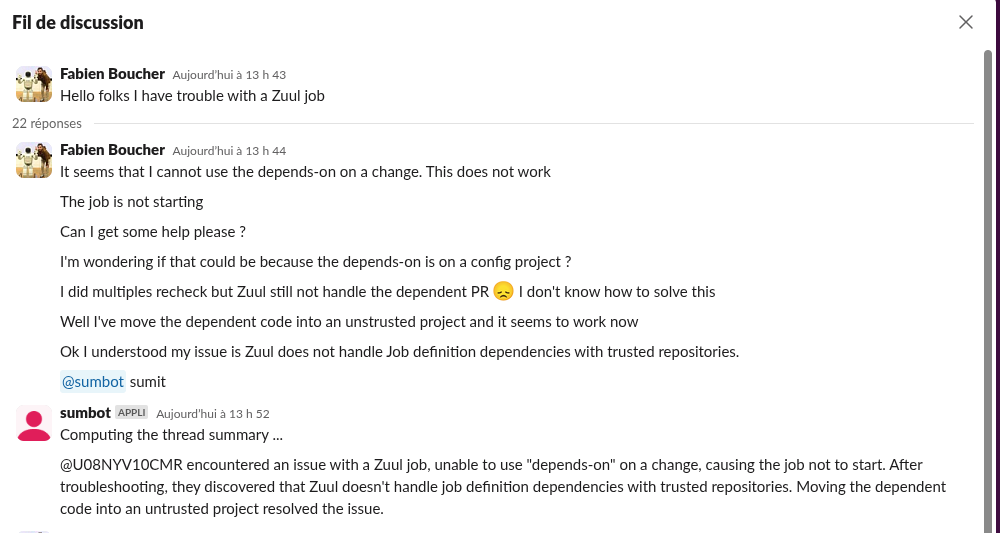

# Slack-AI-Assistant

Is a Hack project that was aiming to show a POC of a Slack Bot capable of summarizing a Slack thread using a LLM Backend.



The LLM backend is an llama.cpp compatible HTTP API. For my testing I was using ramalama and the ibm-granite's granite-3.3-8b-instruct-Q4_0.gguf.

The bot is built using some Haskell libraries to open a WebSocket connection to a Slack server in order to react to events and to call some Slack API endpoint to post messages.

## How to run it

### Setup the LLM backend

On a Fedora server:

```
$ pip install ramalama
$ ramalama serve --net host --port 8080  hf://ibm-granite/granite-3.3-8b-instruct-GGUF/granite-3.3-8b-instruct-Q4_0.gguf
```
The llama.cpp API is now available on port 8080. A web chat is also available if you connect with your browser.

### Setup the Slack application

On https://api.slack.com/apps create New App, from Scratch. Set a `name` and a `workspace`.

Then `Generate App Level Token` and add the scope `connections:write` (this for Slack to send events over the WebSocket).
Copy the generated token.

Then go on the `Socket Mode` page and enable the Socket mode.

Go to `Events Subscriptions` page, then `Add bot user event` and add the event `message.channel`. Save changes.

In `OAuth & Permissions` add `chat:write`.

In `Install App`, install the app on the workspace.
Copy the `Bot User OAuth Token`.

### Build and run the bot

## Demo

The bot's app must be added to the channel, just mention the bot with `@<bot-name>`.

```sh
export SLACK_APP_TOKEN=xapp-******
export SLACK_BOT_TOKEN=xoxb-******
export SLACK_BOT_ID=U08PT646HD1
cabal run
```
